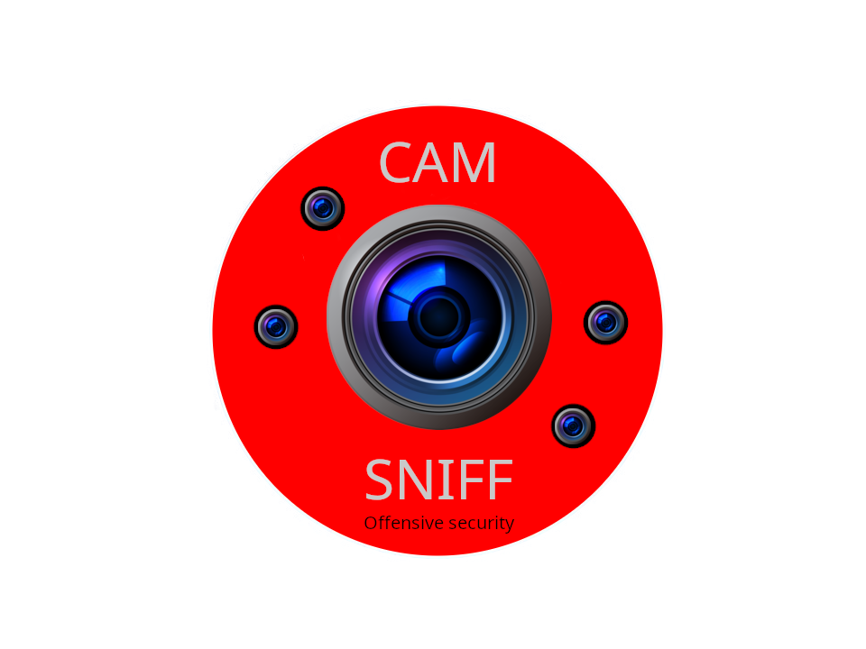

# CamSniff

> **Automated IP Camera & Network Video Stream Reconnaissance Toolkit**
> Smart, mode-aware reconnaissance that maps every camera and stream across your infrastructure, from living rooms to datacenters.

<div align="center">

[](https://github.com/John0n1/CamSniff/commits/main)
[](#)
[](#)
[](LICENSE)

**Current version:** `2.2.3` · 



</div>

---

# Table of contents

1. [Overview](#overview)
2. [Why CamSniff?](#why-camsniff)
3. [Feature matrix](#feature-matrix)
4. [Architecture & flow](#architecture--flow)
5. [Project layout](#project-layout)
6. [Scanning modes](#scanning-modes)
7. [Install & quick start](#install--quick-start)
8. [Command line examples](#command-line-examples)
9. [Output format & artifacts](#output-format--artifacts)
10. [Discovery & profiling logic (short)](#discovery--profiling-logic-short)
11. [Credential probing behavior](#credential-probing-behavior)
12. [Configuration & extending dictionaries](#configuration--extending-dictionaries)
13. [Analysis helper & IVRE integration](#analysis-helper--ivre-integration)
14. [Dependencies](#dependencies)
15. [Troubleshooting & tips](#troubleshooting--tips)
16. [Hardening, ethics & responsible use](#hardening-ethics--responsible-use)
17. [Contributing & roadmap](#contributing--roadmap)
18. [License](#license)

---

# Overview

**CamSniff** is a modular reconnaissance toolkit focused on discovering, profiling and opportunistically acquiring snapshots/streams from IP cameras and networked video sources on *local networks*. It blends active scanning (Nmap, optional Masscan), passive discovery (Avahi/mDNS/SSDP), short traffic sampling (TShark), HTTP/ONVIF banner pulls, and vendor templates (`data/catalog/paths.csv`) to produce structured, reproducible results.

Key design points:

* Mode-aware: tune from **stealth** → **nuke** for noise vs coverage tradeoffs
* Multi-protocol: RTSP, ONVIF, HLS, WebRTC, SRT, RTMP, CoAP probes, etc.
* Output: structured JSON (`discovery.json`, `credentials.json`) + thumbnails & logs
* Offline-friendly: no external lookups required — vendor intelligence lives in `data/`

> ⚠️ **Responsible use only** — Do **not** scan or capture media from devices/networks you are not explicitly authorized to test. Treat captured imagery and credentials as highly sensitive.

---

# Why CamSniff?

* Reduce repetitive manual recon: one command yields a consistent, auditable dataset.
* Templated vendor intelligence speeds up discovery of likely snapshot/RTSP endpoints.
* Tunable credential probing keeps operations traceable and bounded by the chosen mode.
* Designed to be integrated with IVRE for persistent, queryable reconnaissance databases.

---

# Feature matrix

| Area                | Highlights                                                                         |
| ------------------- | ---------------------------------------------------------------------------------- |
| Discovery           | Nmap TCP/UDP scan, NSE RTSP brute, optional Masscan + SSDP broadcast sweep         |
| Target specification| Auto-detect local network or load from JSON/text files with `--targets`            |
| Passive             | Avahi/mDNS & SSDP filtering for camera/service keywords; HTTP banner harvesting    |
| Traffic sampling    | Targeted TShark captures to extract observed URIs                                  |
| Protocols           | ONVIF (incl. device info), RTSP, HLS, WebRTC/STUN, RTMP, SRT, CoAP `/.well-known/core` |
| Vendor profiling    | `data/catalog/paths.csv` maps OUI/heuristics → RTSP/HTTP templates + CVEs          |
| Credential strategy | Mode-limited curated username/password lists, default combos                       |
| Acquisition         | ffmpeg RTSP grabs, HTTP snapshot requests, optional ASCII previews (chafa)         |
| Output              | `discovery.json`, `credentials.json`, thumbnails, HTTP/ONVIF/SSDP metadata logs    |
| Extras              | IVRE sync script, post-scan analysis scripts, enrichers                            |

---

# Architecture & flow (concise)

1. Decide mode (timings, breadth, credential caps) via `scripts/core/mode-config.sh`.
2. Active scan: Nmap (scripted RTSP brute NSE); optional Masscan merges ports.
3. Passive discovery: SSDP broadcast sweep + Avahi/mDNS for camera/service keywords.
4. Traffic sampling: TShark capture on observed hosts to find candidate URIs.
5. UDP micro-scan for STUN/WS-Discovery/SRT indicators.
6. CoAP probe to `/.well-known/core` for constrained devices.
7. HTTP metadata & ONVIF device-info pulls for banner/realm correlation.
8. Vendor matching using `data/catalog/paths.csv` → produce candidate RTSP/HTTP templates.
9. Assemble `discovery.json` and run credential/media acquisition phase.
10. Optionally, push to IVRE with `--extra ivre`.

---

# Project layout

* `scripts/camsniff.sh` — launcher/orchestrator for every scan phase.
* `scripts/core/` — mode/port profile logic and other shared knobs.
* `scripts/setup/` — dependency/bootstrap helpers (libcoap build, package install).
* `scripts/probes/` — SSDP, ONVIF, credential probe, and related active modules.
* `scripts/helpers/` — Python utilities for catalog enrichment, HTTP parsing, RTSP summaries.
* `scripts/integrations/` — IVRE sync and manager utilities.
* `scripts/tools/` — analysis/reporting helpers.
* `scripts/ui/` — banner and terminal rendering helpers.
* `data/catalog/` — vendor templates + CVEs.
* `data/dictionaries/` — credentials, HTTP/RTSP dictionaries.
* `data/examples/` — sample target lists.
* `data/protocols/` — NSE RTSP brute script and protocol assets.

---

# Scanning modes (summary)

Each mode adjusts port profiles, timing, Masscan usage, NSE breadth, and maximum credential attempts.

|         Mode | Masscan |      Nmap speed      | Creds (max) | TShark (s) | Use case                |
| -----------: | :-----: | :------------------: | :---------: | :--------: | ----------------------- |
|   `stealth+` |    no   |          -T1         |      8      |     15     | Minimal noise, slowest  |
|    `stealth` |    no   |          -T2         |      12     |     20     | Quiet local scans       |
|     `medium` |   yes   |          -T4         |      32     |     35     | Default balanced        |
| `aggressive` |   yes   |        -T4 -A        |      64     |     45     | More scripts/versioning |
|        `war` |   yes   |        -T5 -A        |      96     |     55     | Broad vendor coverage   |
|       `nuke` |   yes   | -T5 -A --script vuln |     128     |     75     | Full sweep (1–65535)    |

Default: `--mode medium`. Example: `sudo camsniff --mode stealth`.

---

# Install & quick start

## A — From releases (Debian package)

```bash
# download latest release .deb
sudo apt install ./camsniff_*amd64.deb
# run
sudo camsniff --mode medium
```

## B — From source (developer / live edits)

```bash
git clone https://github.com/John0n1/CamSniff.git
cd CamSniff
chmod +x scripts/*.sh data/*.sh
sudo scripts/camsniff.sh        # first run bootstraps dependencies if needed
```

> On first run the script attempts to install or build missing runtime tooling (where possible). Read logs in `dev/results/<run>/logs/` if a dependency fails.

---

# Command line examples

```bash
# quick balanced scan (default intensity)
sudo camsniff --mode medium

# quiet scan (low footprint)
sudo camsniff --mode stealth+

# aggressive, include IVRE ingestion
sudo camsniff --mode aggressive --extra ivre

# skip confirmation (non-interactive)
sudo camsniff --yes

# pin output location and tag the run
sudo camsniff --output-root /mnt/scan-results --run-name office

# force a specific capture interface for tshark
sudo camsniff --interface eth0

# skip automated credential probing
sudo camsniff --skip-credentials

# skip dependency installation (assumes tools are already present)
sudo camsniff --skip-install

# generate a markdown or HTML report
sudo camsniff --report markdown
sudo camsniff --report html

# smart target shaping and confidence ranking
sudo camsniff --smart --smart-min 35 --smart-max 60

# enrich SSDP results with device descriptions
sudo camsniff --ssdp-describe

# encrypt results (auto-selects age/gpg)
sudo camsniff --encrypt-results --encrypt-recipient "age1example..."

# force gpg encryption with a key id
sudo camsniff --encrypt-results gpg --encrypt-recipient "KEYID"

# scan specific IP ranges from a JSON file
sudo camsniff --mode medium --targets /path/to/targets.json

# scan specific IP ranges from a text file
sudo camsniff --mode war --targets /path/to/targets.txt

# show help / version
sudo camsniff --help
sudo camsniff --version
```

---

# Output format & artifacts

All run outputs live in `dev/results/<UTC_TIMESTAMP>/` by default:

You can override the base directory with `--output-root` and append a label with
`--run-name`. Example: `/mnt/scan-results/20250101T000000Z-office/`.

Reports are written as `report.md` or `report.html` inside each run directory.
When `--encrypt-results` is enabled an encrypted `.tar.gz.age` or `.tar.gz.gpg`
archive is created alongside the run directory (plaintext remains on disk).
For GPG symmetric encryption without prompts, set `CAM_ENCRYPT_PASSPHRASE`.

* `discovery.json` — canonical host dataset with enrichment metadata + confidence scoring
* `credentials.json` — credential attempts & successes per host
* `thumbnails/` — JPEG snapshots of successful grabs (organized per run)
* `logs/` — raw phase logs (`nmap-output.txt`, `masscan-output.json`, `avahi-services.txt`, `tshark-traffic.csv`, `coap-probe.log`, `http-metadata.jsonl`, `ssdp-discovery.jsonl`, `onvif-discovery.jsonl`)
* `analysis/` — optional aggregated statistics from `scripts/tools/analyze.sh`

`discovery.json` snapshot example (trimmed):

```jsonc
{
  "ip": "192.168.1.42",
  "mac": "AA:BB:CC:DD:EE:FF",
  "sources": ["Nmap","TShark","Avahi"],
  "ports": [80,554,8443],
  "observed_paths": ["/onvif/device_service", "rtsp://..."],
  "profile_match":{
    "vendor":"VendorX",
    "model":"ModelY",
    "matched_by":"oui",
    "rtsp_candidates":[...],
    "http_snapshot_candidates":[...],
    "cve_ids":["CVE-2024-XXXX"]
  },
  "confidence": {
    "score": 78,
    "level": "high",
    "classification": "camera",
    "reasons": ["rtsp url discovered", "onvif detected"]
  }
}
```

---

# Discovery & profiling logic (short)

* **Observed evidence**: Nmap + TShark + Avahi merge into a host record.
* **Heuristics**: port fingerprints, OUI regex, observed HTTP/RTSP URIs, ONVIF/SSDP/HTTP banners.
* **Vendor templates**: `data/catalog/paths.csv` contains OUI & port heuristics → RTSP/HTTP templates + CVEs.
* **Enrichment**: small Python post-processor ranks candidates and annotates `discovery.json`.
* **Smart targeting**: `--smart` prioritizes deeper probes using early signals and prints a confidence ranking.
* **SSDP describe**: `--ssdp-describe` fetches device descriptions to boost fingerprints.

---

# Credential probing behavior

`scripts/credential-probe.sh` uses:

1. Vendor default combos (from `data/catalog/paths.csv`) + blank/empty password checks.
2. Curated, mode-bounded username/password pair lists (`data/dictionaries/usernames.txt`, `data/dictionaries/passwords.txt`).
3. Enumerated RTSP paths (profile + brute + observed from TShark).
4. HTTP snapshot templated endpoints (`data/dictionaries/http-paths.txt`).

Successful attempts record: credential pair, endpoint used, thumbnail path, timestamp. **Credentials are stored in plain JSON** — treat them as sensitive material and secure results directories accordingly.

---

# Target file formats

CamSniff can ingest IP addresses and CIDR ranges from external files using the `--targets` flag. This allows for pre-defined target lists and integration with other reconnaissance tools.

## JSON format

```json
{
  "targets": [
    "192.168.1.0/24",
    "10.0.0.1",
    "172.16.0.0/28"
  ]
}
```

The JSON file must contain a `targets` array with IP addresses and/or CIDR ranges as strings.

## Text format

```
# Comment lines starting with # are ignored
192.168.1.0/24
10.0.0.1

# Another network
172.16.0.0/28
```

Text files support one IP address or CIDR range per line. Empty lines and lines starting with `#` are ignored. Whitespace is automatically trimmed.

## Usage examples

```bash
# Scan targets from JSON file
sudo camsniff --mode medium --targets /path/to/targets.json

# Scan targets from text file
sudo camsniff --mode war --targets /path/to/targets.txt

# Use the included example files
sudo camsniff --mode medium --targets data/examples/example-targets.json
```

Example target files are provided in the `data/` directory:
- `data/examples/example-targets.json` — JSON format example
- `data/examples/example-targets.txt` — Text format example

When using `--targets`, the script bypasses automatic network detection and scans only the specified targets.

---

# Configuration & extending dictionaries

All dictionaries live in `data/` and are editable:

* `catalog/paths.csv` — vendor OUI regex → default creds, RTSP/HTTP templates, CVE IDs
* `dictionaries/rtsp-urls.txt` — extend RTSP brute dictionary for NSE
* `dictionaries/http-paths.txt` — fallback HTTP snapshot endpoints (templated)
* `dictionaries/usernames.txt` / `dictionaries/passwords.txt` — curated credential lists (comments ignored)
* `vendors/<vendor>/http-paths.txt` — vendor-specific HTTP snapshot templates
* `vendors/<vendor>/rtsp-paths.txt` — vendor-specific RTSP templates
* `core/port-profiles.sh` — logical named port sets used per scanning mode

After edits, next run will use updated files. Keep additions concise, verifiable, and documented (one vendor per row ideally).

Vendor dictionary format:

- HTTP: `template|port|channel|stream|label`
- RTSP: `template|port|channel|stream|transport|label`

Templates may include `{{ip_address}}`, `{{username}}`, `{{password}}`, `{{port}}`,
`{{channel}}`, and `{{stream}}` placeholders.

---

# Analysis helper & IVRE integration

* `scripts/tools/analyze.sh` — prints host counts, vendor diversity, RTSP discovery volume, credential success rate.
* `scripts/integrations/ivre-manager.sh` — optionally bootstraps a Python venv with IVRE + pymongo and pushes enriched hosts into IVRE (use `--extra ivre`).

---

# Dependencies

Core runtime (auto-installed where possible):

* nmap, masscan (optional), tshark (wireshark/tshark), avahi-utils, ffmpeg, curl, jq, python3 (+ venv), chafa (optional, for ASCII previews), libpcap.
* Build tools for libcoap / `coap-client` (`git`, `cmake`, `build-essential`, `pkg-config`) — script `scripts/setup/build-coap.sh` will attempt to build if missing.

---

# Troubleshooting & tips

* **Empty `discovery.json`** — verify interface, ARP visibility, run non-stealth mode for testing.
* **Masscan skipped** — ensure `--mode` permits it (e.g., `medium`+).
* **No thumbnails** — check `ffmpeg` availability and per-host logs in `dev/results/<run>/logs/`.
* **ONVIF false negatives** — SSL/certificate redirects or nonstandard ports can hide endpoints — try `curl -k` manually against suspected endpoints.
* **CoAP probes failing** — build `coap-client` via `scripts/setup/build-coap.sh`, inspect `logs/coap-probe.log`.
* **Performance** — if `nuke` takes too long, use `medium` or a custom port profile.

Environment toggles:

* `NO_ANIM=1` — skip ASCII/intro animation (useful in CI).
* `CAM_MODE_PORT_PROFILE` — override port profile programmatically (advanced).

---

# Hardening, ethics & responsible use

* **Authorization** — never use CamSniff on networks/devices without explicit, written permission.
* **Data protection** — captured images, device metadata and credentials are sensitive — encrypt and limit access.
* **Least impact** — start with `stealth` modes during discovery and escalate only when authorized.
* **CVE data** — treated as advisory; manual verification and safe disclosure practices required.
* **Avoid uncontrolled credential spraying** — credential attempts are mode-bounded; respect target operational stability.

---

# Contributing

1. Fork → create feature branch.
2. Make focused changes (one concern per PR).
3. Run `make lint` (uses `shellcheck`) and `scripts/test` if available.
4. Add sample outputs or before/after notes where relevant.
5. Submit PR and reference related issues.

Guidelines:

* Document every vendor template change and source of truth.
* Prefer small, testable commits; avoid large binary additions.
* Keep default dictionaries conservative — do not include proprietary credential lists.

---

# Roadmap (short)

* Web dashboard: realtime JSON + thumbnails.
* Live mosaic / timeline capture mode.
* Encrypted credential store & role-based access.
* Pluggable exporters: Markdown/HTML summary reports.
* Additional protocol signatures (MQTT, SIP, more proprietary APIs).

Have a feature idea? Please open an issue describing the use case.

---

# License

MIT — see [LICENSE](LICENSE). <sub>© 2025 John Hauger Mitander. The authors disclaim responsibility for misuse. Practice ethical security research.</sub>
