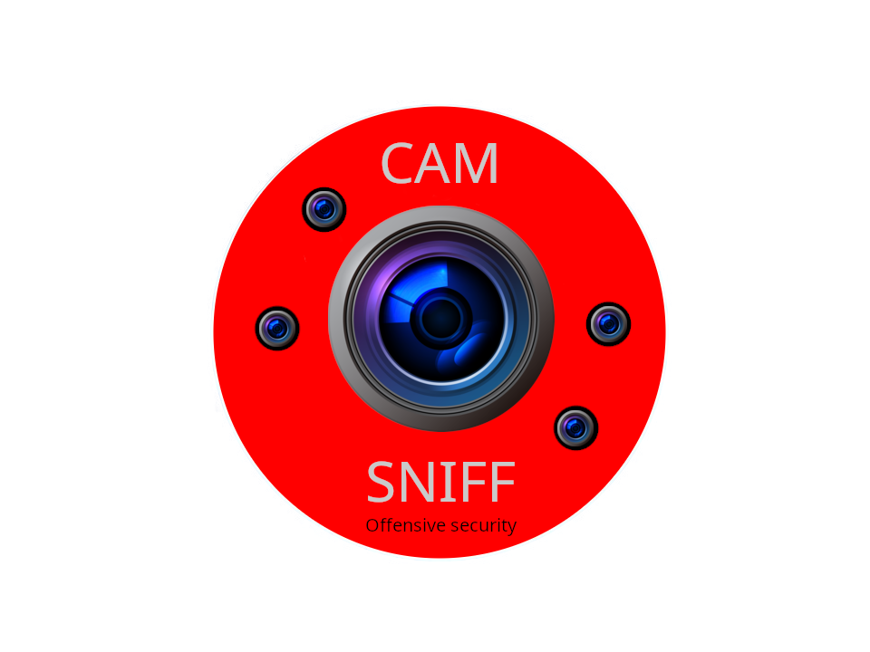

<div align="center">

# CamSniff

Automated IP Camera & Network Video Stream Reconnaissance Toolkit

[](https://github.com/John0n1/CamSniff/commits/main)
[](#)

<sup>Current version:</sup> `2.1.0`

<br/>


<br/>

</div>

---

## Table of Contents

1. [Overview](#overview)
2. [Feature Matrix](#feature-matrix)
3. [Architecture & Flow](#architecture--flow)
4. [Scanning Modes](#scanning-modes)
5. [Installation](#installation)
6. [Quick Start](#quick-start)
7. [Command Line Usage](#command-line-usage)
8. [Discovery & Profiling Logic](#discovery--profiling-logic)
9. [Credential Probing](#credential-probing)
10. [Outputs & Artifacts](#outputs--artifacts)
11. [Data Dictionaries](#data-dictionaries)
12. [Configuration & Extensibility](#configuration--extensibility)
13. [Analysis Helper](#analysis-helper)
14. [Dependencies](#dependencies)
15. [Troubleshooting](#troubleshooting)
16. [Hardening & Ethics](#hardening--ethics)
17. [Contributing](#contributing)
18. [Roadmap](#roadmap)
19. [License](#license)

---

## Overview

CamSniff is a mode‑aware, data‑driven reconnaissance toolkit focused on identifying IP cameras and related streaming / telemetry endpoints on a *local* network. It fuses coordinated active scanning (Nmap + optional Masscan) with passive / service discovery (Avahi/mDNS) and short opportunistic traffic captures (TShark) to build a unified host profile. It then enriches results using an embedded vendor intelligence catalogue (`data/paths.csv`) and performs adaptive HTTP + RTSP snapshot acquisition with credential heuristics.

> ⚠️ **Responsible Use Only** – You must have explicit, written authorization to assess any network or device you target. All results can contain sensitive imagery or metadata; handle and store them appropriately.

Primary design goals:

- Minimise manual iteration while keeping workflow transparent
- Provide reproducible structured output (`discovery.json` + `credentials.json`)
- Surface multi‑protocol exposure (RTSP / ONVIF / HLS / WebRTC / SRT / RTMP)
- Offer tunable scan intensity profiles for stealth vs coverage
- Maintain offline‑friendly operation (no external lookups required)

---

## Feature Matrix

| Category | Capabilities |
|----------|--------------|
| Discovery | Nmap (scripted RTSP brute), optional Masscan port sweep, UDP service probe (STUN/WS-Discovery/SRT) |
| Passive / Broadcast | Avahi (mDNS/DNS‑SD) filtered for camera/service keywords |
| Traffic Sampling | Targeted TShark capture (HTTP, RTSP, common media / control ports) to extract candidate paths |
| Protocol Heuristics | ONVIF, HLS playlist probe, RTMP port detection, WebRTC (STUN/TURN & HTTP surface), SRT signature ports |
| Vendor Profiling | OUI & port‑based profile match against `paths.csv`; CVE ID references and snapshot/RTSP templates |
| RTSP Enumeration | Bundled `rtsp-url-brute.nse` + optional custom list `data/rtsp-urls.txt` |
| Credential Strategy | Default credentials + combinatorial curated username/password sets (mode‑limited) |
| Media Acquisition | HTTP snapshot endpoints & RTSP frame grabs (ffmpeg) with optional ASCII preview (chafa) |
| Output | Structured JSON, terminal summary tables, thumbnails + logs |
| Modes | `stealth` → `unphantmoable` (max) adjusting ports, timing, retries, credential breadth |
| Enrichment | Post‑scan Python enrichment to attach probabilistic vendor profile & candidate stream URLs |
| Post Processing | `scripts/analyze.sh` summarises coverage & success metrics |

---

## Architecture & Flow

1. Initialisation & mode resolution (`scripts/mode-config.sh`) → sets timing, port profile, credential caps
2. Nmap TCP sweep + (if present) NSE RTSP brute script → collects open ports & RTSP path candidates
3. Optional Masscan wide sweep (depending on mode) → merges additional port intelligence
4. Avahi / mDNS enumeration → candidate IP + service hints
5. Short TShark capture (duration mode‑dependent) → extracts HTTP/RTSP URIs to augment observed paths
6. UDP micro‑scan (select protocol ports) → enriches ONVIF / WebRTC / SRT indicators
7. Vendor matching (OUI regex & port heuristics) using `data/paths.csv` → candidate templates & CVEs
8. JSON assembly (`discovery.json`) + enrichment (Python inline script)
9. Credential & media acquisition phase (`scripts/credential-probe.sh`) → builds `credentials.json` & thumbnails
10. Optional retrospective statistics (`scripts/analyze.sh`)

---

## Scanning Modes

Each mode tunes: port breadth, Masscan enablement & rate, Nmap timing, TShark duration, HTTP/RTSP timeouts, retry counts, and credential attempt ceiling.

| Mode | Masscan | Port Profile | Nmap Speed | Credentials (max) | TShark (s) | Notes |
|------|---------|--------------|------------|-------------------|------------|-------|
| stealth | no | core | -T2 | 12 | 20 | Minimal footprint |
| ultra stealth | no | minimal | -T1 + scan delay | 8 | 15 | Slowest / least noisy |
| medium | yes | standard | -T4 | 32 | 35 | Balanced default |
| aggressive | yes | extended | -T4 -A | 64 | 45 | Adds service/version scripts |
| war | yes | war | -T5 -A | 96 | 55 | Broad vendor coverage |
| unphantmoable | yes | total | -T5 -A --script vuln | 128 | 75 | Full 1–65535 spectrum, vuln scripts |

Invoke via: `--mode <name>` (default: `unphantmoable` if unspecified).

---

## Installation

### Option 1: Package Build (Debian based)

```bash
make build   # produces a .deb using debian/ packaging
sudo apt install ./camsniff_*amd64.deb
```

### Option 2: Install Dependencies + Run From Source

```bash
git clone https://github.com/John0n1/CamSniff.git
cd CamSniff
make install-deps   # or: sudo ./scripts/deps-install.sh
```

### Option 3: Minimal Manual Prep

Ensure tools (`nmap`, `avahi-browse`, `tshark`, `ffmpeg`, `curl`, `jq`, `masscan` if using higher modes) are installed; then run `sudo ./scripts/camsniff.sh`.

> A Python virtual environment is created automatically for enrichment & JSON handling.

---

## Quick Start

```bash
sudo ./scripts/camsniff.sh --yes                  # default (unphantmoable)
sudo ./scripts/camsniff.sh --mode medium --yes    # balanced sweep
sudo ./scripts/camsniff.sh --mode stealth         # interactive confirm
make run MODE=war RUN_FLAGS="--yes"              # via Makefile helper
```

To inspect most recent results:

```bash
./scripts/analyze.sh
```

---

## Command Line Usage

```text
Usage: camsniff.sh [--mode <name>] [--yes] [--version] [--help]

Options:
	-m, --mode <name>    stealth | ultra stealth | medium | aggressive | war | unphantmoable
	-y, --yes            Auto-confirm prompt
	-v, --version        Print version (from VERSION file)
	-h, --help           Show usage
```

Exit status: `0` on success, non‑zero on setup or dependency failure.

---

## Discovery & Profiling Logic

After the core scan sequence, each host record in `discovery.json` includes:

```jsonc
{
	"ip": "192.168.1.42",
	"mac": "AA:BB:CC:DD:EE:FF",
	"sources": ["Nmap", "TShark", "Avahi"],
	"ports": [80, 554, 8443],
	"observed_paths": ["/onvif/device_service", "rtsp://..."],
	"rtsp_bruteforce": {
		"discovered": ["rtsp://192.168.1.42:554/Streaming/Channels/101"],
		"other_responses": {"401": ["rtsp://..."]}
	},
	"additional_protocols": [
		{"protocol": "ONVIF", "detail": "https://192.168.1.42:8443/onvif/device_service (HTTP 401)"},
		{"protocol": "HLS", "detail": "http://192.168.1.42:8080/live.m3u8"}
	],
	"profile_match": {
		"vendor": "VendorX",
		"model": "ModelY",
		"matched_by": "oui",
		"rtsp_candidates": [...],
		"http_snapshot_candidates": [...],
		"cve_ids": ["CVE-2024-XXXX"],
		"reference": "https://support.vendorx.example/manual"
	}
}
```

Protocol inference heuristics (e.g. HLS playlist detection, ONVIF endpoint status codes, STUN/TURN port presence) populate `additional_protocols` to highlight multi‑surface exposure.

---

## Credential Probing

`scripts/credential-probe.sh` consumes `discovery.json` and attempts snapshot retrieval using:

1. Vendor default credential combos (if present) + blank password variations
2. Small curated username/password dictionaries (bounded per mode)
3. Enumerated RTSP path candidates (profile + brute + observed traffic)
4. Fallback HTTP snapshot templates (`data/http-paths.txt`)

Successful acquisitions produce:

- Full‐resolution JPEG thumbnail (`dev/results/<run>/thumbnails/*.jpg`)
- Optional ASCII preview (`*.txt`) if `chafa` is installed
- Structured JSON row with credential pair (never obfuscated – treat as sensitive)

Failures are still recorded with attempt counts for auditability.

---

## Outputs & Artifacts

`dev/results/<UTC_TIMESTAMP>/` contains:

| Path | Description |
|------|-------------|
| `discovery.json` | Canonical host dataset + enrichment metadata |
| `credentials.json` | Per‑host success/failure credential attempts & media capture descriptors |
| `logs/` | Raw command logs (`nmap-output.txt`, `masscan-output.json`, `avahi-services.txt`, `tshark-traffic.csv`, credential probe logs) |
| `thumbnails/` | Captured snapshots (HTTP/RTSP) + ASCII previews |
| `logs/nmap-udp-output.txt` | UDP probe results (WS‑Discovery / STUN / SRT) |

Run summarisation:

```bash
./scripts/analyze.sh --run 20250101T120000Z   # or omit --run for latest
```

---

## Data Dictionaries

Located in `data/`:

| File | Purpose |
|------|---------|
| `paths.csv` | Vendor OUI regex, default creds, CVE IDs, RTSP/HTTP templates, stream/channel enumerations |
| `rtsp-url-brute.nse` | Embedded NSE dictionary for RTSP path brute‑forcing |
| `rtsp-urls.txt` | Optional extended RTSP dictionary injected into NSE when present |
| `http-paths.txt` | Fallback HTTP snapshot endpoints (templated) |
| `usernames.txt` / `passwords.txt` | Curated credential lists (comments & blanks ignored) |
| `port-profiles.sh` | Nmap/Masscan logical port set definitions & thread heuristics |
| `cves.json` | Supplemental CVE reference metadata (consumed indirectly via enrichment) |

All files are editable – updates take effect on next run.

---

## Configuration & Extensibility

Extension points:

- Add new vendor patterns in `paths.csv` (regex on OUI or port) – include CVE IDs and snapshot/RTSP templates
- Append extra RTSP paths to `rtsp-urls.txt` for NSE integration
- Provide additional HTTP fallback patterns in `http-paths.txt`
- Modify credential breadth / timing by adjusting mode logic in `scripts/mode-config.sh`
- Insert new protocol heuristics inside `scripts/camsniff.sh` (see `detect_hls`, `detect_onvif`, etc.)

> Keep patches minimal & tested: run `make lint` before submitting PRs.

---

## Analysis Helper

`scripts/analyze.sh` prints structured statistics (host counts, vendor diversity, protocol hits, RTSP discovery volume, credential success rate). Use it to baseline changes between scanning modes or dictionary adjustments.

---

## Dependencies

Core tooling (auto‑installed via `make install-deps` on supported package managers):

- Nmap, Masscan, TShark, Avahi utilities, ffmpeg, curl, jq, python3 (+ venv), chafa (optional), libpcap, shell utilities.

If dependency installation is skipped, missing tools simply reduce coverage (warnings emitted, run continues best‑effort).

---

## Troubleshooting

| Symptom | Possible Cause | Mitigation |
|---------|----------------|-----------|
| Empty `discovery.json` | No reachable hosts / blocked broadcast traffic | Verify network interface, run in less stealthy mode |
| Masscan skipped | Mode disables it | Choose `medium` or higher |
| Few credential attempts | Mode cap (see table) | Use higher intensity mode |
| No thumbnails | Snapshot endpoints failed / ffmpeg missing | Confirm creds, install ffmpeg, inspect per‑host logs |
| ONVIF not detected | Ports closed or HTTPS cert issues | Check with `curl -k` manually |
| Slow run | Large port profile + vuln scripts | Use `medium` or custom reduced port profile |
| High false positives | Broad port sweep in `unphantmoable` | Cross‑check with targeted `standard` scan |

Logs for each phase live under `dev/results/<run>/logs/`.

Environment toggles:

- `NO_ANIM=1` – skip matrix intro for non‑interactive terminals
- `CAM_MODE_PORT_PROFILE` override (advanced, via mode modifications)

---

## Hardening & Ethics

- Run only against authorised assets / lab networks
- Secure captured media (may contain personally identifiable imagery)
- Rotate credential dictionaries to avoid accidental inclusion of sensitive proprietary lists
- Prefer lowest effective mode first (principle of minimal impact)
- Treat CVE references as advisory; verification requires manual validation

---

## Contributing

1. Fork repository & create feature branch
2. Make focused changes (one concern per PR)
3. Run: `make lint` (requires `shellcheck` installed)
4. Provide before/after explanation or sample output where applicable
5. Submit PR referencing any related issues

Scope guidelines:

- Keep vendor catalog additions concise & verifiable
- Avoid embedding large binary assets
- Wrap new logic with comments describing rationale

---

## Roadmap

- Optional web dashboard (real‑time JSON rendering)
- Live stream mosaic / timeline mode
- Encrypted credential store for sensitive captures
- Multi‑interface enumeration & explicit interface selection flag
- Pluggable output exporters (Markdown / HTML summary)
- Additional protocol signatures (MQTT, CoAP for hybrid IoT cams)

Have a suggestion? Open an issue with a clear use case.

---

## License

MIT – see [LICENSE](LICENSE).

---

<sub>© 2025 John Hauger Mitander. The authors disclaim responsibility for misuse. Practice ethical security research.</sub>
