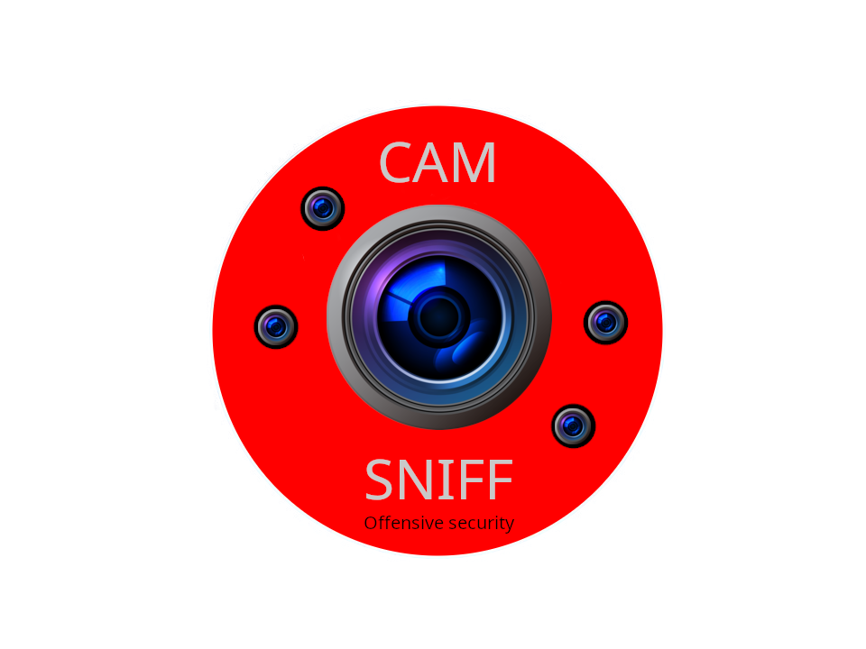

# CamSniff

> Authorized reconnaissance for IP cameras and network video endpoints.

<div align="center">

[](https://github.com/John0n1/CamSniff/actions/workflows/build-deb.yml)
[](https://github.com/John0n1/CamSniff/actions/workflows/build-arch.yml)
[](LICENSE)

**Version 2.2.6**



</div>

CamSniff combines active scanning, local service discovery, short packet
captures, protocol probes, and a vendor catalogue into one reproducible camera
inventory. It produces structured evidence instead of treating a common port as
proof of a particular vendor or device type.

> [!CAUTION]
> Run CamSniff only against systems and networks you are explicitly authorized
> to assess. Credential results and captured images are sensitive data.

## What it does

- Scans selected IPv4 addresses and CIDRs with Nmap and optional Masscan.
- Correlates RTSP, HTTP, ONVIF, SSDP, mDNS, HLS, RTMP, SRT, WebRTC, and optional
  CoAP signals.
- Uses OUI, banner, path, and protocol evidence to rank vendor profiles.
- Tries bounded HTTP/RTSP credential candidates and validates captured media.
- Emits schema-versioned JSON, raw logs, optional reports, and thumbnails.
- Optionally synchronizes discovery and credential results into IVRE.

Version 2.2.6 strengthens scope enforcement, keeps TCP and UDP services
separate, validates media before reporting success, redacts credentials from
rendered reports, and adds regression-tested Debian and Arch packaging.

## How a run flows

```text
authorized targets
      │
      ├─ Nmap + optional Masscan
      ├─ SSDP/mDNS + short TShark capture
      ├─ focused UDP/HTTP/ONVIF probes
      │
      ▼
evidence correlation + confidence scoring
      │
      ├─ discovery.json
      ├─ bounded credential/media checks
      ├─ optional Markdown/HTML report
      └─ optional IVRE synchronization
```

Every discovered address is checked against the original target list before it
can become a candidate or receive a follow-up probe. TShark request traffic is
interpreted directionally so clients are not promoted as camera servers.

## Modes

| Mode | Port profile | Masscan | Credential cap | Probe window | Intended use |
|---|---|---:|---:|---:|---|
| `stealth+` | minimal | no | 16 | 90 s | Lowest-volume targeted check |
| `stealth` | core | no | 32 | 60 s | Quiet production discovery |
| `medium` | standard | yes | 64 | 120 s | Default balanced audit |
| `aggressive` | extended | yes | 96 | 150 s | Richer service evidence |
| `war` | broad vendor set | yes | 128 | 180 s | Authorized high-coverage sweep |
| `nuke` | ports 1–65535 | yes | 256 | 240 s | Isolated lab or explicit full audit |

See [Mode reference](docs/modes.md) and
[Scanning configuration](docs/scanning.md) for exact rates, flags, and ports.

## Installation

### Debian or Ubuntu package

```bash
sudo apt install ./camsniff_2.2.6_all.deb
sudo camsniff --mode medium
```

### Arch Linux package

The repository PKGBUILD packages the current checkout, making it suitable for
release CI and local validation:

```bash
make arch-verify
make arch-package
sudo pacman -U packaging/arch/camsniff-2.2.6-1-any.pkg.tar.zst
sudo camsniff --mode medium
```

### Source checkout

```bash
git clone https://github.com/John0n1/CamSniff.git
cd CamSniff
sudo ./bin/camsniff --mode medium
```

Missing required tools can be installed on the first run. Pass
`--skip-install` when dependencies are managed by the operating system.
`coap-client` is optional and is built only when `make build-coap` is requested.

## Safe first run

Start with an explicit target file and disable credential attempts until the
discovery output looks correct:

```text
# targets.txt
192.168.50.20
192.168.50.32/28
```

```bash
sudo camsniff \
  --mode stealth \
  --targets targets.txt \
  --skip-credentials \
  --report markdown
```

JSON target files are also accepted:

```json
{
  "targets": ["192.168.50.20", "192.168.50.32/28"]
}
```

If `--targets` is omitted, CamSniff uses the IPv4 prefix assigned to the default
interface. It does not guess a `/24` from the gateway address.

## Common options

```text
--mode <name>           Select stealth+, stealth, medium, aggressive, war, nuke
--targets <file>        Load authorized IPv4 addresses/CIDRs from JSON or text
--output-root <dir>     Choose the artifact base directory
--run-name <label>      Add a readable suffix to the timestamped run directory
--interface <iface>     Select the TShark capture interface
--skip-credentials      Disable credential and media acquisition attempts
--skip-install          Never invoke the dependency installer
--smart                 Prioritize deeper probes using preliminary evidence
--ssdp-describe         Fetch in-scope SSDP device descriptions
--report <format>       Generate markdown, html, or both
--encrypt-results       Create an age/GPG encrypted archive after the run
--extra ivre            Set up and synchronize with IVRE
--yes                   Skip interactive confirmation
```

Run `camsniff --help` for the complete CLI contract.

## Results and data handling

Source checkouts write to `dev/results/<timestamp>/`. Installed packages write
to `/var/lib/camsniff/results/<timestamp>/`. Override either with
`--output-root`.

```text
<run>/
├── discovery.json       canonical host and service evidence
├── credentials.json     canonical credential results, when enabled
├── report.md|html       redacted human-readable report
├── paths.json           vendor catalogue snapshot
├── thumbnails/          validated HTTP/RTSP captures
└── logs/                raw output from each discovery/probe phase
```

Run directories are owner-only (`0700`) and files inherit an owner-only umask.
Rendered reports redact passwords and URL userinfo; `credentials.json` remains
sensitive. Encryption creates an encrypted archive alongside the plaintext run
directory, so remove or relocate plaintext only after independently verifying
the archive.

Discovery schema version 2 represents transport explicitly:

```json
{
  "schema_version": 2,
  "hosts": [
    {
      "ip": "192.168.50.20",
      "services": [
        {"protocol": "tcp", "port": 554, "state": "open"},
        {"protocol": "udp", "port": 3702, "state": "open_filtered"}
      ],
      "confidence": {
        "score": 72,
        "classification": "camera"
      }
    }
  ]
}
```

## Configuration and integrations

- [Mode reference](docs/modes.md) — exact mode behavior and selection guidance.
- [Scanning configuration](docs/scanning.md) — scanner flags, port profiles, and
  protocol interpretation.
- [Customization and IVRE](docs/customisation.md) — catalogue/dictionary formats
  and supported IVRE commands.
- [Development helpers](docs/dev-helpers.md) — tests, linting, and package builds.
- [Vendor data guide](data/vendors/README.md) — vendor-specific endpoint files.

Primary editable data lives under `data/catalog/`, `data/dictionaries/`, and
`data/vendors/`. Keep additions narrow and evidence-backed. A port match alone
is deliberately insufficient to claim a vendor.

## Development and release checks

```bash
make test           # regression suite
make lint           # shellcheck plus Bash syntax
make arch-verify    # PKGBUILD/.SRCINFO consistency
make arch-package   # build the current checkout for pacman
make build          # build the Debian package
```

GitHub Actions independently build both package formats. The regression suite
also covers target containment, SSDP URL scope, TShark CSV parsing, Masscan
contracts, TCP/UDP preservation, report redaction, profile confidence, and
credential/media probing behavior.

## Troubleshooting

- **No candidates:** inspect `logs/nmap-command.log`, the selected target file,
  and the chosen port profile before increasing scan intensity.
- **Masscan disabled:** install Masscan and use `medium` or a higher mode.
- **Avahi warning:** confirm the Avahi daemon and D-Bus are available; the phase
  is optional and failures are logged in `logs/avahi-command.log`.
- **No thumbnails:** inspect per-host FFmpeg/curl logs. A 200 response is not
  sufficient; the resulting file must contain a valid video stream.
- **CoAP skipped:** install a working `coap-client` explicitly; CamSniff no
  longer builds unpinned network source during an ordinary scan.

## Contributing

Keep changes focused, add regression coverage for altered behavior, and run the
development checks above. Do not add broad credential lists or unverified
vendor/CVE claims. See [CONTRIBUTING.md](CONTRIBUTING.md) for the development,
testing, data-evidence, and pull-request guidelines. Report vulnerabilities
privately according to [SECURITY.md](SECURITY.md).

## License

MIT — see [LICENSE](LICENSE). CamSniff is provided for authorized security work;
the authors are not responsible for misuse.
